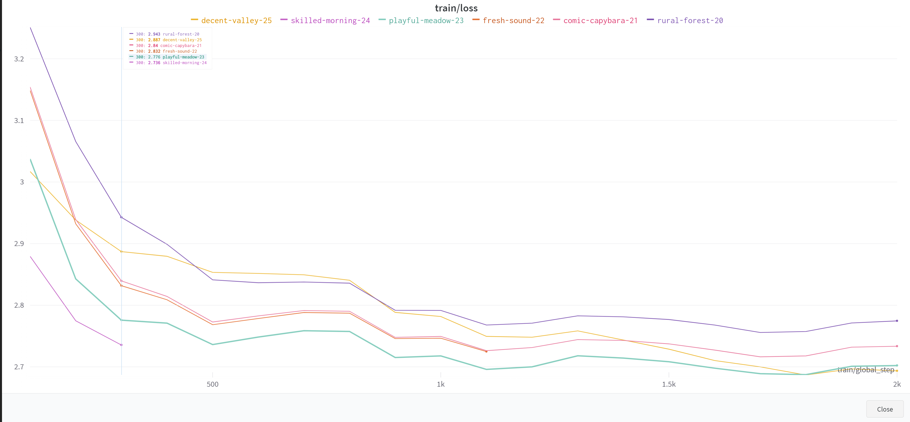
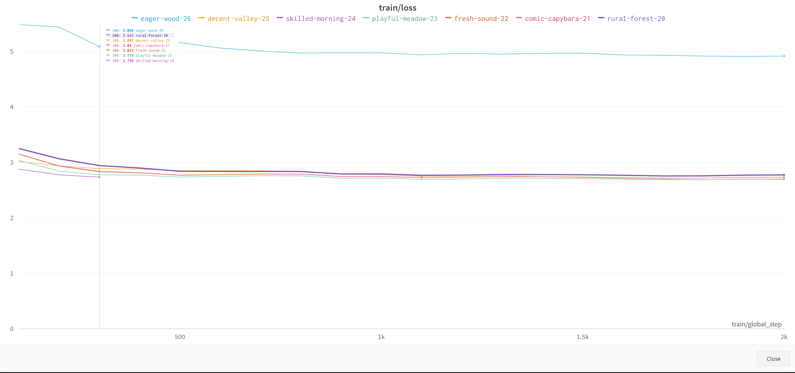

# Day 10-11

## Goal
- Train GPT-Medium locally with Lora
- Train LLama or ChatGLM 6M remotely
- Servilize a machine.

## Details
- Understand Lora and using it in Hugging face [ PEFT: Parameter-Efficient Fine-Tuning of Billion-Scale Models on Low-Resource Hardware](https://huggingface.co/blog/peft)
- Understand if lora can really train and effective.
    - Yes, the lora_alpha parameter range is not clear, seems like is the weight merge with main model, from below experiments, 🍒 shows lora alpha is plays more significant roles in the training efficiency. and the range in 1-10000, is a reasonable.
    - rank=4, alpha=8 (run20)
    - rank=4, alpha=32 (run21)
    - rank=16, alpha=32 (run22)
    - rank=4, alpha=100 (run23)
    - rank=4, alpha=1000 (run24)
    - rank=4, alpha=10000 (run25)
    - rank=4, alpha=100000 (run25)
    - the results looks like in below images:
    - 
    - 
- Train with Lora in GPT2-Medium but didn't see improvement on GPU usage and trainl loss is not decrease

## QnA
- How the GPU Memory related with the Model's hyper parameter.
    - this 
